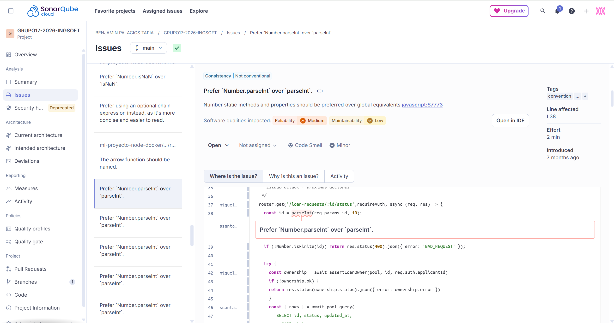
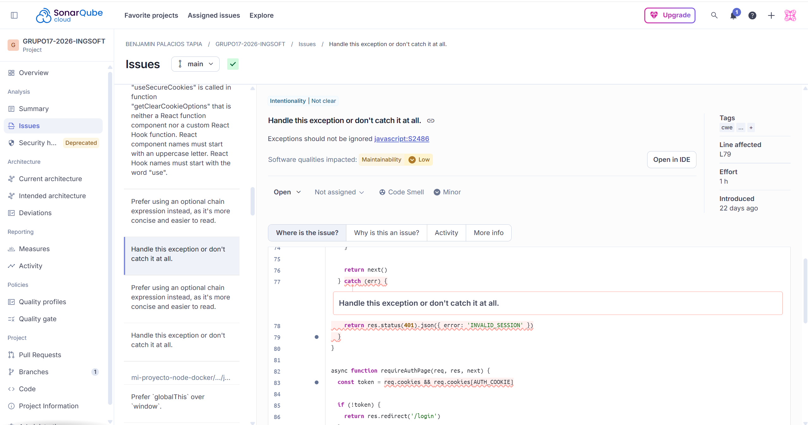

# Reporte de Inspección de Código - SonarQube / SonarCloud

Este documento detalla los resultados de la inspección de software inicial realizada sobre el repositorio del proyecto mediante la plataforma SonarCloud. Se identificaron un total de 77 issues, de los cuales se seleccionaron 2 patrones críticos y repetitivos para su documentación y posterior corrección.

---

## 1. Análisis de Quality Issues Seleccionados

### Quality Issue 1: Uso obsoleto de variables globales (parseInt)
* **Archivo original analizado:** `mi-proyecto-node-docker/src/routes/loanStatus.js`
* **Tipo:** Code Smell
* **Severidad:** Minor

#### Captura de Pantalla (Antes del cambio):

#### Descripción Técnica:
La herramienta detectó el uso directo de la función global `parseInt()`. En las especificaciones modernas de JavaScript (ECMAScript 6 y posteriores), se recomienda imperativamente invocar esta función a través del objeto global `Number` (es decir, `Number.parseInt()`).

---

### Quality Issue 2: Bloques de manejo de excepciones vacíos (try-catch)
* **Archivo original analizado:** `mi-proyecto-node-docker/src/middleware/auth.js`
* **Tipo:** Code Smell
* **Severidad:** Minor (Con alto impacto operativo)

#### Captura de Pantalla (Antes del cambio):

#### Descripción Técnica:
SonarCloud identificó la presencia de bloques `try-catch` donde la sección del `catch` se encuentra completamente vacía ("Handle this exception or don't catch it at all").

---

## 2. Estrategia de Abordaje

**Decisión del Equipo:**
Al revisar detalladamente el reporte completo de la inspección, se notó que estos dos problemas no eran hallazgos aislados, sino **patrones de malas prácticas de codificación repetidos sistemáticamente** a lo largo de múltiples capas del sistema (rutas, servicios, middlewares y workers). 

Por lo tanto **se tomó la decisión de ingeniería de abordar ambas recomendaciones de forma global** en todo el repositorio:

1. Se ejecutó una refactorización en todo el proyecto para sustituir cada instancia de `parseInt()` por el estándar moderno `Number.parseInt()`.
2. Se intervinieron todos los bloques `catch` vacíos identificados en el backend para implementar una estructura de manejo de excepciones adecuada, asegurando que los errores queden correctamente registrados en la consola (`console.error`) y que las peticiones respondan un estado HTTP de error controlado en lugar de colgar el servidor.
